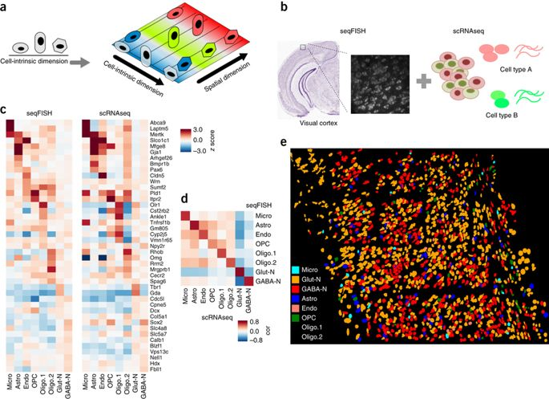

# Hackathon - Cortex seq-FISH + scRNA data

### Background

This study integrates sequencing and imaging-based single-cell transcriptomic profiling methods. The authors showed that the incorporation of scRNAseq data improved cell-type mapping using seqFISH data analysis alone while including the seqFISH data enabled the identification of spatial structure in the scRNAseq data (Figure from Zhu *et al* 2018). For our workshop, we focus on a subset of these data that contain matched seqFISH and scRNAseq data for the adult mouse visual cortex.




### Key articles 

Zhu *et al* 2018, reference paper for seqFISH is available at: (https://www.nature.com/articles/nbt.4260)

Tasic *et al* 2016, reference paper for scRNAseq is available at: (https://www.nature.com/articles/nn.4216)


### Main

This repo is focusing on one challenge question: what is the minimal number of genes needed for data integration. To integrate the two omics data, the key information we need to know is what types of cells are there and which spatial coordinates do they map to.

#### Dependency

- python 3
- python packages:
  - scanpy (v1.4.5.1)
  - numpy (v1.18.1)
  - pandas (v1.0.1)
  - matplotlib (v3.1.3)
  - seaborn (v0.10.1)
  - scikit-learn (v0.22.1)
  - yellowbrick (v1.1)
  
  

#### Preprocessing

Starting from the raw scRNAseq data, we used package Scanpy, followed by a standard recipe for filtering, normalization, and highly variable gene annotation. Among the 113 genes that overlapped between scRNAdeq and seqFish data, 46 genes are annotated as high variable genes. These high variable genes could best represent cell types in scRNAseq data.

```bash
tar -xzvf rsc/tasic_scRNAseq/full_scRNAseq/GSE71585_RefSeq_counts.tar.gz
python scr/preprocess_scRNA.py \
-i rsc/tasic_scRNAseq/full_scRNAseq/GSE71585_RefSeq_counts.csv
```


#### Gene Selection

To find out what is the minimal number of genes needed, we recursively train an SVM classification model using a different number of genes and evaluate the performance using cross-validation. This process is done using `evl_model.py` which performs the 'Recursive Feature Elimination (RFE)' method. Results could be found in folder `figures`.

```bash
python scr/eva_model.py \
-g rsc/highly_variable_genes.tsv \
-r rsc/tasic_scRNAseq/tasic_training_b2.txt \
-rl rsc/tasic_scRNAseq/tasic_labels.tsv \
-s rsc/tasic_scRNAseq/seqfish_cortex_b2_testing.txt \
-sl rsc/tasic_scRNAseq/seqfish_labels.tsv
```


